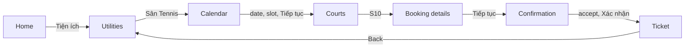

# vh-tennis-booker

[](https://github.com/servedbyhau/vh-tennis-booker/actions/workflows/ci.yml)


A UI-automation case study: driving the tennis-court booking flow of a third-party
**Flutter** Android app (Vinhomes Resident) with **Python** and **uiautomator2** on the
MuMu Player emulator, using only the app's user interface.

> [!IMPORTANT]
> This is an educational project, not affiliated with or endorsed by Vinhomes.
> The app refuses to operate while Android developer mode is enabled, which ADB requires,
> so this project cannot be used for real bookings and does not attempt to bypass that check.

## Features

- **Label-based element lookup.** Buttons are located at runtime by their accessibility
  labels, so the automation works at any screen resolution.
- **Unlabeled widgets.** The consent checkbox is identified as the small clickable node
  level with its caption; no other node is ever tapped.
- **Lag tolerance.** Each step taps as soon as the button appears and retries if the next
  screen does not load.
- **Scroll into view.** Time slots below the fold are scrolled to until fully visible and
  clear of the sticky bottom button.
- **Verified results.** A round succeeds only after the app leaves the confirmation screen.
- **Step timing.** Each log line shows the time elapsed since the previous step.
- **Configurable labels.** All app strings live in `config.toml`.

## How it works



Each configured slot is booked in its own round. See [docs/how-it-works.md](docs/how-it-works.md)
for design notes.

## Requirements

- Windows with [MuMu Player](https://www.mumuplayer.com/), ADB reachable at `127.0.0.1:7555`
- Python 3.9 or later

## Installation

```bash
git clone https://github.com/servedbyhau/vh-tennis-booker.git
cd vh-tennis-booker
pip install -e .
cp config.example.toml config.toml
```

## Usage

Open the app on its home screen, then run:

```bash
court-booker --dry-run          # stop before the final confirmation
court-booker                    # book the slots from config.toml
court-booker --slots "18:00 - 19:00" "19:00 - 20:00" --days 2
court-booker --verbose          # include retries and element positions
```

If `court-booker` is not on `PATH`, use `python -m court_booker` instead.

Sample output:

```text
11:12:05.231 +0.42s INFO    Tapped 'Sân Tennis'
11:12:06.010 +0.78s INFO    Selected date 2026-10-03
11:12:07.402 +1.39s INFO    Selected slot 14:00 - 15:00 (2 swipe(s))
11:12:09.118 +1.72s INFO    Accepted terms
```

To inspect a screen whose elements cannot be found:

```bash
python tools/inspect_screen.py --near "Tôi đã hiểu"
```

## Project structure

```text
src/court_booker/
├── cli.py              command-line entry point
├── config.py           defaults and config.toml loading
├── errors.py           exception hierarchy
├── flow.py             booking flow, one method per screen
├── geometry.py         pure helpers for bounds and dates
└── logging_setup.py    console logging with step timing
tools/inspect_screen.py UI hierarchy dump
tests/                  unit tests with a fake device
```

## Development

```bash
pip install -e ".[dev]"
pre-commit install
pytest
```

See [CONTRIBUTING.md](CONTRIBUTING.md) for conventions and the release process.

## License

[MIT](LICENSE)
