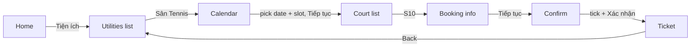

# vh-tennis-booker

[](https://github.com/<your-username>/vh-tennis-booker/actions/workflows/ci.yml)


> 🇻🇳 [Đọc bằng tiếng Việt](README.vi.md)

A UI-automation case study: driving the tennis-court booking flow of a third-party
**Flutter** Android app (Vinhomes Resident) with **Python + uiautomator2** on the
MuMu Player emulator — with no access to the app's source code or API, only its UI.

> [!IMPORTANT]
> **Educational project.** Not affiliated with or endorsed by Vinhomes.
> The app detects Android developer mode (required by ADB), so it is intentionally
> not usable for real bookings. This repository documents the automation techniques;
> it does not include, and will not include, any way to bypass that check.
> Respect the app's terms of use and other residents.

## Highlights

- **No hard-coded coordinates.** Every button is located at runtime by its
  accessibility label (Flutter exposes text through `content-desc`), so the script
  works at any screen resolution.
- **Label-anchored lookup for unlabeled widgets.** The consent checkbox has no label;
  it is found as the small clickable node *beside and level with* its caption, and
  nothing else is ever tapped.
- **Lag-tolerant navigation.** Each step taps as soon as the button appears, then waits
  for the *next* screen; a tap swallowed by a lagging app is retried.
- **Scroll-into-view.** Time slots below the fold are scrolled to until fully visible
  and not covered by the sticky bottom button.
- **Verified outcomes.** A booking is reported as successful only after the app leaves
  the confirmation screen.
- **Step timing.** Every log line carries milliseconds and the time since the previous
  step, to separate script overhead from app latency.
- **All UI text in config.** If the app renames a button or switches language, edit
  `config.toml`; no code changes.

## Flow



Each configured slot is one round; round 2 starts from the utilities list.

## Quick start

Requirements: Windows, [MuMu Player](https://www.mumuplayer.com/) with ADB at
`127.0.0.1:7555`, Python 3.9+.

```bash
git clone https://github.com/HauPham-Wts/vh-tennis-booker.git
cd vh-tennis-booker
pip install -e .
copy config.example.toml config.toml   # optional: edit slots, court, labels
```

Open the app on its home screen, then:

```bash
court-booker --dry-run                                   # stops before the final "Xác nhận"
court-booker --slots "18:00 - 19:00" "19:00 - 20:00"     # override slots
court-booker --days 2 --device 127.0.0.1:7555
```

Example output:

```
[11:12:05.231 +0.42s] OK  Sân Tennis
[11:12:06.010 +0.78s] OK  Chọn ngày 03/10/2026
[11:12:07.402 +1.39s] OK  Chọn khung giờ 14:00 - 15:00 (đã kéo 2 lần)
```

## Inspecting a screen

When a widget cannot be found, dump the UI tree of the current screen:

```bash
python tools/inspect_screen.py --near "Tôi đã hiểu"
```

## Project layout

```
src/court_booker/
  cli.py        command-line entry point
  config.py     defaults + config.toml loading
  flow.py       one method per app screen (Booker)
  geometry.py   pure helpers: bounds, alignment, date patterns
  log.py        step logger with millisecond timing
tools/inspect_screen.py   UI-tree dump / widget finder
tests/                    unit tests with a fake device (no emulator needed)
docs/how-it-works.md      design notes and lessons learned
```

## Development

```bash
pip install -e ".[dev]"
ruff check .
pytest
```

## License

[MIT](LICENSE)
