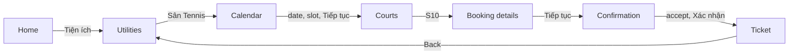

# vh-tennis-booker

[](https://github.com/servedbyhau/vh-tennis-booker/actions/workflows/ci.yml)


A UI-automation case study: driving the tennis-court booking flow of a third-party
**Flutter** Android app (Vinhomes Resident) with **Python** and **uiautomator2** on the
MuMu Player emulator, using only the app's user interface.

> [!IMPORTANT]
> This is an educational project, not affiliated with or endorsed by Vinhomes.
> The app refuses to operate while Android developer mode is enabled, which ADB requires,
> so this project cannot be used for real bookings and does not attempt to bypass that check.

## Features

- **Label-based element lookup.** Buttons are located at runtime by their accessibility
  labels, so the automation works at any screen resolution.
- **Unlabeled widgets.** The consent checkbox is identified as the small clickable node
  level with its caption; no other node is ever tapped.
- **Lag tolerance.** Each step taps as soon as the button appears and retries if the next
  screen does not load.
- **Scroll into view.** Time slots below the fold are scrolled to until fully visible and
  clear of the sticky bottom button.
- **Verified results.** A round succeeds only after the app leaves the confirmation screen.
- **Step timing.** Each log line shows the time elapsed since the previous step.
- **Configurable labels.** All app strings live in `config.toml`.
- **Unattended.** A daily scheduled task wakes the PC, starts the emulator, connects ADB,
  restarts the app and books at the exact opening time.
- **Precise start.** The PC clock is corrected against an NTP server; the first tap lands
  within about a millisecond of the start time, and the calendar is reloaded until the new
  date is listed.
- **Reporting.** Daily log files, exit codes per failure type and an optional Telegram summary.

## How it works



Each configured slot is booked in its own round. See [docs/how-it-works.md](docs/how-it-works.md)
for design notes.

## Requirements

- Windows with [MuMu Player](https://www.mumuplayer.com/) and the Vinhomes app logged in
- ADB: Google platform-tools on `PATH`, or the `adb.exe` that ships with MuMu
- Python 3.9 or later

## Installation

```bash
git clone https://github.com/servedbyhau/vh-tennis-booker.git
cd vh-tennis-booker
pip install -e .
cp config.example.toml config.toml
```

## Usage

The emulator and the app are started automatically. Run:

```bash
court-booker --dry-run          # stop before the final confirmation
court-booker                    # book the slots from config.toml now
court-booker --at 06:00         # prepare now, start booking at 06:00:00
court-booker --scheduled        # same, using start_at from config.toml
court-booker --slots "18:00 - 19:00" "19:00 - 20:00" --days 2
court-booker --verbose          # include retries and element positions
```

Slots are booked one after another, so list the most wanted slot first.

### Unattended daily booking

```bash
court-booker schedule install   # daily task at wake_at (05:45) running --scheduled
court-booker schedule status    # show the task, its last and next run
court-booker schedule remove    # delete the task
```

One-time Windows setup:

- Leave the PC on or in **Sleep**; a shut-down PC cannot be woken.
- Keep it plugged in and enable *Power Options → Sleep → Allow wake timers*.
- Stay signed in to Windows (a locked screen is fine); MuMu needs the desktop session.
- Keep the Vinhomes app logged in inside MuMu.

Test the whole chain first with `court-booker --at <in 3 minutes> --dry-run` and MuMu
closed. Each run is logged to `logs/court-booker-YYYY-MM-DD.log`; set `telegram_token` and
`telegram_chat_id` to receive the summary on your phone.

| Exit code | Meaning |
|---|---|
| 0 | every round succeeded |
| 1 | a round failed |
| 2 | bad arguments or config, or the start time has passed |
| 3 | emulator or ADB error |
| 4 | the app did not reach its home screen (e.g. logged out) |
| 130 | interrupted with Ctrl+C |

If `court-booker` is not on `PATH`, use `python -m court_booker` instead.

Sample output:

```text
11:12:05.231 +0.42s INFO    Tapped 'Sân Tennis'
11:12:06.010 +0.78s INFO    Selected date 2026-10-03
11:12:07.402 +1.39s INFO    Selected slot 14:00 - 15:00 (2 swipe(s))
11:12:09.118 +1.72s INFO    Accepted terms
```

To inspect a screen whose elements cannot be found:

```bash
python tools/inspect_screen.py --near "Tôi đã hiểu"
```

## Project structure

```text
src/court_booker/
├── cli.py              command-line entry point and exit codes
├── runner.py           one run: connect, prepare, wait, book every slot
├── emulator.py         start MuMu through MuMuManager.exe
├── adb.py              find adb and connect the emulator
├── flow.py             booking flow, one method per screen
├── clock.py            start time, NTP offset, precise wait
├── power.py            keep Windows awake during a run
├── notify.py           Telegram summary
├── schedule.py         Windows scheduled task
├── config.py           defaults and config.toml loading
├── errors.py           exception hierarchy
├── geometry.py         pure helpers for bounds and dates
└── logging_setup.py    console and file logging with step timing
tools/inspect_screen.py UI hierarchy dump
tests/                  unit tests with fake devices, adb, clocks and schtasks
```

## Development

```bash
pip install -e ".[dev]"
pre-commit install
pytest
```

See [CONTRIBUTING.md](CONTRIBUTING.md) for conventions and the release process.

## License

[MIT](LICENSE)
